<div align="center">


</div>

<div align="center">

# Tolerex — HaToKuSe Distributed Message Storage System

<p>
  
  
  
  
  
</p>

<p>
  <b>Tolerex</b> is a <b>fault-tolerant distributed message storage system</b><br/>
  developed as part of the <b>System Programming</b> course.
</p>

<p>
  Leader-based architecture • Configurable replication factor •  
  Crash-tolerant reads • Disk persistence • Secure gRPC communication
</p>

<p>
  <a href="#quick-start">Quick Start</a> •
  <a href="#architecture">Architecture</a> •
  <a href="#dependencies">Dependencies</a> •
  <a href="#test-scenarios">Test Scenarios</a> •
  <a href="#project-structure">Project Structure</a>
</p>

</div>

## Project Overview

This project implements a distributed, fault-tolerant message storage system
based on a leader–replica (member) architecture.

The system is inspired by modern distributed platforms such as
Apache Kafka and RabbitMQ, and focuses on demonstrating:

- Replication and fault tolerance
- Load-balanced data distribution
- Crash-aware read recovery
- Disk-based persistent storage
- Secure inter-node communication using gRPC and mTLS

Client interaction is performed using a custom lightweight text-based protocol
called **HaToKuSe (Hata-Tolere Kuyruk Servisi)**.

---


## Quick Start

### Prerequisites
- **Go 1.21+** - [Download](https://go.dev/dl/)
- **Protocol Buffers compiler (protoc)** - For regenerating `.proto` files (optional for basic usage)
- **OpenSSL** - For mTLS certificate generation (certificates are pre-included)
- **Docker & Docker Compose** - For monitoring stack (optional)

### Installation

**1. Clone Repository**

```bash
git clone https://github.com/YasinEnginExpert/Tolerex.git
cd Tolerex
```

**2. Install Dependencies**

```bash
go mod tidy
```

**3. Verify Installation**

```bash
go build ./cmd/leader/main.go
go build ./cmd/member/main.go
go build ./client/test_client.go
```

If all commands complete without errors, you're ready to run the system.

---

### Option 1: Automated Cluster Launch (Recommended)

The **Cluster Launcher** provides an interactive menu for starting a complete local cluster.

**Start the Launcher:**

```bash
go run cmd/cluster_launcher/cluster_launcher.go
```

**Interactive Setup:**

```
=== TOLEREX LOCAL CLUSTER LAUNCHER ===
Number of CLIENTS: 2
Number of MEMBERS: 3
IO mode [buffered | unbuffered]: buffered
Enable RTT measurement for clients? [yes | no]: yes
Enable CSV output for RTT? [yes | no]: yes

--- Configuration Summary ---
Client count  : 2
Member count  : 3
IO Mode       : buffered
RTT Measure   : yes
CSV Output    : yes
TCP Addr      : localhost:6666
-----------------------------
```

The launcher will automatically:
1. Start the Leader node in a new PowerShell window
2. Start 3 Member nodes (ports 5556-5558) in separate windows
3. Start 2 Client instances with unique IDs (`client-1`, `client-2`)
4. Redirect CSV output to `measured/client-1.csv` and `measured/client-2.csv`

**Usage in Client Windows:**

```bash
# Send a single message
tolerex> SET 1 Hello World
OK

# Retrieve a message
tolerex> GET 1
Hello World

# Bulk operation (1000 messages)
tolerex> 1000 SET load_test
BULK DONE: 1000 SET in 245 ms (avg 245 us) | bytes=50000 | sampleRTT=450 us

# Exit
tolerex> QUIT
```

---

### Option 2: Manual Component Launch

For more control, you can manually start each component in separate terminals.

**Terminal 1 - Start Leader:**

```powershell
# Windows PowerShell
$env:LEADER_GRPC_PORT='5555'
$env:LEADER_METRICS_PORT='9090'
go run cmd/leader/main.go
```

```bash
# Linux/Mac
export LEADER_GRPC_PORT=5555
export LEADER_METRICS_PORT=9090
go run cmd/leader/main.go
```

**Expected Output:**

```
2026/01/14 21:00:00 [LEADER] Leader server starting
2026/01/14 21:00:00 [LEADER] Starting gRPC server on port 5555
2026/01/14 21:00:00 [LEADER] Starting TCP control plane on port 6666
2026/01/14 21:00:00 [LEADER] Heartbeat watcher started (timeout=15s, interval=5s)
2026/01/14 21:00:00 [LEADER] Prometheus metrics endpoint running on :9090
```

**Terminal 2 - Start Member 1:**

```powershell
# Windows PowerShell
$env:LEADER_ADDR='localhost:5555'
$env:MEMBER_ADDR='localhost:5556'
go run cmd/member/main.go -port=5556 -metrics=9092 -io=buffered
```

```bash
# Linux/Mac
export LEADER_ADDR=localhost:5555
export MEMBER_ADDR=localhost:5556
go run cmd/member/main.go -port=5556 -metrics=9092 -io=buffered
```

**Expected Output:**

```
2026/01/14 21:00:05 [MEMBER] Member server starting
2026/01/14 21:00:05 [MEMBER] Starting gRPC server on port 5556
2026/01/14 21:00:05 [MEMBER] Member running (dataDir=internal/data/member-5556, io=buffered)
2026/01/14 21:00:06 [MEMBER] Registering to leader at localhost:5555 as localhost:5556
2026/01/14 21:00:06 [MEMBER] Registration successful
2026/01/14 21:00:06 [MEMBER] Heartbeat loop started
```

**Terminal 3 - Start Member 2 (Optional):**

```powershell
$env:LEADER_ADDR='localhost:5555'
$env:MEMBER_ADDR='localhost:5557'
go run cmd/member/main.go -port=5557 -metrics=9093 -io=buffered
```

**Terminal 4 - Start Client:**

```bash
# Basic client
go run client/test_client.go

# Client with RTT measurement
go run client/test_client.go -measure

# Client with CSV export
go run client/test_client.go -measure -csv > measured/client.csv

# Multi-client setup (run in separate terminals)
go run client/test_client.go -measure -csv -id client-1 -offset 0
go run client/test_client.go -measure -csv -id client-2 -offset 100000
```

**Expected Client Output:**

```
Connecting to localhost:6666...
Connected.

--------------------------------------------------------------------------------
                    TOLEREX – Hata-Tolere Kuyruk Servisi
--------------------------------------------------------------------------------
Commands:
  SET <id> <message>   - Store a message
  GET <id>             - Retrieve a message
  <N> SET <message>    - Bulk store N messages
  HELP                 - Show this help
  QUIT / EXIT          - Disconnect
--------------------------------------------------------------------------------

tolerex> 
```

---

### Option 3: Monitoring Stack Setup

If you want to visualize metrics in Grafana:

**1. Start Prometheus & Grafana:**

```bash
cd deploy
docker-compose up -d
```

**2. Verify Services:**

```bash
# Check Prometheus (should return metrics)
curl http://localhost:9091/api/v1/targets

# Access Grafana UI
# Open browser: http://localhost:3000
# Login: admin / admin
```

**3. Import Dashboard:**

- In Grafana, go to **Dashboards** → **Import**
- Upload `deploy/grafana_dashboard.json`
- Select **Prometheus** as data source
- Click **Import**

**4. Generate Load:**

Use any of the client methods above to generate traffic. Metrics will appear in Grafana within 5-10 seconds.

---

### Quick Test Scenario

**Complete End-to-End Test:**

```bash
# Terminal 1: Start Leader
go run cmd/leader/main.go

# Terminal 2: Start Member
go run cmd/member/main.go -port=5556

# Terminal 3: Run automated test
go run client/test_client.go -measure -csv << EOF
SET 1 First_Message
GET 1
100 SET stress_test
QUIT
EOF
```

**Expected CSV Output:**

```csv
Timestamp,ClientID,Operation,Count,Bytes,RTT_us
21:30:45.123,client,SET,1,25,450
21:30:45.200,client,GET,1,22,380
21:30:46.500,client,BULK_SET,100,5000,420
```

---


## Configuration

The system can be configured via environment variables or `.env` file.

| Variable | Options | Description |
| :--- | :--- | :--- |
| `LEADER_GRPC_PORT` | `5555` | Port for Leader-Member communication |
| `LEADER_METRICS_PORT` | `9090` | Prometheus scrape port for Leader |
| `MEMBER_ADDR` | `host:port` | Member's own address for registration |
| `TOLEREX_TEST_MODE` | `1` or `0` | Disables mTLS for local testing (default: 0) |
| `BALANCER_STRATEGY` | `least_loaded` or `p2c` | Selects load balancing algorithm (default: `least_loaded`) |

### Load Balancing Strategies

You can switch between two load balancing algorithms by setting the `BALANCER_STRATEGY` environment variable:

1.  **Least Loaded (`default`)**:
    - Selects the member with the absolute lowest message count.
    - **Best for:** Small clusters (< 50 nodes) where accuracy is critical.
    - **Algorithmic Cost:** O(N log N) due to sorting.

2.  **Power of Two Choices (`p2c`)**:
    - Picks two random members and selects the one with lower load.
    - **Best for:** Large clusters (> 100 nodes) or high-throughput scenarios.
    - **Algorithmic Cost:** O(1) constant time.

    ```bash
    # Enable P2C Strategy
    export BALANCER_STRATEGY=p2c
    go run cmd/leader/main.go
    ```

---

## Architecture


Tolerex follows a **centralized leader-based architecture**.

### System Roles

- **Client**
  - Sends text-based `SET` and `GET` requests
  - Communicates only with the Leader

- **Leader Node (Coordinator)**
  - Parses HaToKuSe protocol commands
  - Reads replication factor from `tolerance.conf`
  - Selects replica nodes using **Least-Loaded** balancing strategy
  - Maintains metadata index (`message_id → replica list`)
  - Handles failover during read operations
  - **Performance:** Uses persistent gRPC connection pool and concurrent replication

- **Replica Nodes (Members)**
  - Receive replicated data via gRPC
  - Persist messages to local disk
  - Periodically report storage statistics

---

### Request Flow Overview

1. Client sends a **text-based request** to the Leader
2. Leader parses the command and determines replication factor
3. Message is converted into a **Protobuf object**
4. Leader replicates the message to selected replica nodes
5. Replicas persist the message on disk and return ACKs
6. Leader aggregates responses and replies to the client

---

### System Architecture Diagram

```mermaid
graph TB
    %% ===== STYLE DEFINITIONS =====
    classDef clientStyle fill:#E3F2FD,stroke:#1E88E5,stroke-width:3px,color:#0D47A1,stroke-dasharray: 0
    classDef leaderStyle fill:#FFF3E0,stroke:#FB8C00,stroke-width:4px,color:#E65100,stroke-dasharray: 0
    classDef memberStyle fill:#E8F5E9,stroke:#43A047,stroke-width:3px,color:#1B5E20,stroke-dasharray: 0
    classDef storageStyle fill:#F3E5F5,stroke:#8E24AA,stroke-width:2px,color:#4A148C,stroke-dasharray: 5 5
    classDef monitorStyle fill:#FFF9C4,stroke:#F57F17,stroke-width:2px,color:#F57F17,stroke-dasharray: 0
    classDef securityStyle fill:#FFEBEE,stroke:#C62828,stroke-width:2px,color:#B71C1C,stroke-dasharray: 3 3

    %% ===== CLIENT LAYER =====
    subgraph ClientZone["📱 Client Layer"]
        direction LR
        C1["🖥️ Client 1<br/>-id client-1<br/>-offset 0"]
        C2["🖥️ Client 2<br/>-id client-2<br/>-offset 100k"]
        C3["🖥️ Client N<br/>-id client-N<br/>-offset Nk"]
    end

    %% ===== LEADER LAYER =====
    subgraph LeaderZone["⚡ Control Plane - Leader Node"]
        direction TB
        Leader["🎯 LEADER<br/>━━━━━━━━━━━━━<br/>🔌 TCP: 6666 (HaToKuSe)<br/>🔌 gRPC: 5555<br/>📊 Metrics: 9090<br/>━━━━━━━━━━━━━<br/>📋 Balancer: Least-Loaded<br/>🔄 Connection Pool<br/>⚙️ Concurrent Replication"]
        
        subgraph LeaderComponents["Leader Internals"]
            direction LR
            LB["⚖️ Load Balancer"]
            ConnPool["🔗 Connection Pool"]
            StateDB["💾 State DB<br/>leader_state.json"]
        end
        
        Leader -.-> LeaderComponents
    end

    %% ===== MEMBER LAYER =====
    subgraph MemberZone["💾 Data Plane - Replica Nodes"]
        direction LR
        
        subgraph M1["Member 1"]
            Member1["🗄️ MEMBER<br/>Port: 5556<br/>Metrics: 9092"]
            Storage1[("📁 Disk<br/>Buffered I/O")]
            Member1 -.->|writes| Storage1
        end
        
        subgraph M2["Member 2"]
            Member2["🗄️ MEMBER<br/>Port: 5557<br/>Metrics: 9093"]
            Storage2[("📁 Disk<br/>Buffered I/O")]
            Member2 -.->|writes| Storage2
        end
        
        subgraph MN["Member N"]
            MemberN["🗄️ MEMBER<br/>Port: 555X<br/>Metrics: 909X"]
            StorageN[("📁 Disk<br/>Buffered I/O")]
            MemberN -.->|writes| StorageN
        end
    end

    %% ===== MONITORING LAYER =====
    subgraph MonitorZone["📈 Observability Stack"]
        direction LR
        Prometheus["📊 Prometheus<br/>Port: 9091<br/>Scrape: 5s"]
        Grafana["📉 Grafana<br/>Port: 3000<br/>Refresh: 1s"]
        Prometheus --> Grafana
    end

    %% ===== SECURITY LAYER =====
    subgraph SecurityZone["🔐 Security Layer"]
        direction LR
        mTLS["🔒 mTLS<br/>CA + Client Certs"]
        Auth["🛡️ Authorization<br/>CN Verification"]
    end

    %% ===== MAIN FLOWS =====
    C1 ===>|"📝 SET/GET<br/>HaToKuSe Protocol<br/>TCP:6666"| Leader
    C2 ===>|"📝 SET/GET<br/>HaToKuSe Protocol<br/>TCP:6666"| Leader
    C3 ===>|"📝 SET/GET<br/>HaToKuSe Protocol<br/>TCP:6666"| Leader

    Leader ==>|"🔄 Store RPC<br/>🔒 mTLS + Protobuf<br/>Concurrent"| Member1
    Leader ==>|"🔄 Store RPC<br/>🔒 mTLS + Protobuf<br/>Concurrent"| Member2
    Leader ==>|"🔄 Store RPC<br/>🔒 mTLS + Protobuf<br/>Concurrent"| MemberN

    Member1 -->|"✅ ACK<br/>Success"| Leader
    Member2 -->|"✅ ACK<br/>Success"| Leader
    MemberN -->|"✅ ACK<br/>Success"| Leader

    %% ===== MONITORING FLOWS =====
    Leader -.->|"/metrics"| Prometheus
    Member1 -.->|"/metrics"| Prometheus
    Member2 -.->|"/metrics"| Prometheus
    MemberN -.->|"/metrics"| Prometheus

    %% ===== HEARTBEAT FLOWS =====
    Member1 -.->|"💓 Heartbeat<br/>Every 5s"| Leader
    Member2 -.->|"💓 Heartbeat<br/>Every 5s"| Leader
    MemberN -.->|"💓 Heartbeat<br/>Every 5s"| Leader

    %% ===== SECURITY INTEGRATION =====
    SecurityZone -.->|protects| Leader
    SecurityZone -.->|protects| MemberZone

    %% ===== APPLY STYLES =====
    class C1,C2,C3 clientStyle
    class Leader leaderStyle
    class Member1,Member2,MemberN memberStyle
    class Storage1,Storage2,StorageN storageStyle
    class Prometheus,Grafana monitorStyle
    class mTLS,Auth securityStyle
```



### Network Topology & Monitoring Layer

The following diagram illustrates the **containerized network layout**, showing port mappings and the flow of telemetry data.

```mermaid
graph TD
    %% ===== NODE STYLES =====
    classDef container fill:#E1F5FE,stroke:#0288D1,stroke-width:2px,color:#01579B,rx:5,ry:5
    classDef network fill:#F5F5F5,stroke:#9E9E9E,stroke-width:2px,color:#616161,stroke-dasharray: 5 5
    classDef monitor fill:#FFF3E0,stroke:#EF6C00,stroke-width:2px,color:#E65100
    classDef host fill:#FFFFFF,stroke:#333333,stroke-width:3px,color:#000000

    subgraph HostMachine["💻 Host Machine (Windows/Linux)"]
        style HostMachine fill:#FAFAFA,stroke:#333
        
        subgraph DockerNet["🐳 Docker Bridge Network (tolerex-net)"]
            style DockerNet fill:#EEEEEE,stroke:#CCC
            
            %% NODES
            LeaderNode("⚡ Leader Container<br/>(leader:9090)")
            Member1Node("💾 Member-1 Container<br/>(member-1:9092)")
            Member2Node("💾 Member-2 Container<br/>(member-2:9093)")
            Member3Node("💾 Member-3 Container<br/>(member-3:9094)")
            
            %% MONITORING NODES
            PromNode("🔥 Prometheus<br/>(Configuration: prometheus.yml)")
            GrafNode("📊 Grafana<br/>(Dashboard UI)")
            
            %% INTERNAL CONNECTIONS
            LeaderNode -.-> |"Scrape /metrics"| PromNode
            Member1Node -.-> |"Scrape /metrics"| PromNode
            Member2Node -.-> |"Scrape /metrics"| PromNode
            Member3Node -.-> |"Scrape /metrics"| PromNode
            
            PromNode ==> |"Query Data Source"| GrafNode
        end

        %% EXTERNAL PORTS
        UserAdmin["👤 Admin / DevOps"]
        NokiaSwitch["🖧 Nokia Switch<br/>(Core Network)"]
        
        UserAdmin ==> |"Ethernet"| NokiaSwitch
        NokiaSwitch ==> |"VLAN 10: Browser"| GrafNode
        NokiaSwitch ==> |"VLAN 20: TCP"| LeaderNode
        
        %% PORT MAPPINGS
        LeaderNode --- |"Port 5555:5555<br/>Port 6666:6666"| HostPorts1["Host Ports"]
        PromNode --- |"Port 9091:9090"| HostPorts2["Host Ports"]
        GrafNode --- |"Port 3000:3000"| HostPorts3["Host Ports"]
    end

    %% CLASSES
    class LeaderNode,Member1Node,Member2Node,Member3Node container
    class PromNode,GrafNode monitor
```




---

## Advanced Test Client

The `test_client` is a sophisticated load generation and measurement tool designed for distributed system testing.

### Key Features

**1. Dual Mode Operation**
- **Interactive Mode:** Manual command entry (`SET key value`, `GET key`)
- **Stress/Bulk Mode:** High-volume load generation (`1000 SET payload`)

**2. Dual TCP Channel Architecture**
- **Load Channel:** Sends bulk requests "fire-and-forget" for maximum throughput
- **Measurement Channel:** Independent RTT measurement without queuing interference
- This separation ensures accurate latency metrics even under heavy load

**3. Multi-Client Collision Avoidance**
- `-id` flag: Unique client identifier for CSV output
- `-offset` flag: ID range offset (e.g., Client 1 uses 0-100k, Client 2 uses 100k-200k)
- Prevents data overwrites when running multiple concurrent clients

**4. Data Analytics (CSV Export)**
- Format: `Timestamp,ClientID,Operation,Count,Bytes,RTT_us`
- Enables post-analysis with tools like Grafana, Excel, or Python
- Example: `21:30:45.123,client-1,BULK_SET,1000,50000,450`

**5. Command-Line Flags**
```bash
-addr string      # Leader TCP address (default "localhost:6666")
-measure          # Enable RTT measurement via dual-channel
-csv              # Export metrics to CSV (stdout)
-id string        # Client identifier (default "client")
-offset int       # Starting ID offset (default 0)
-flush int        # Buffer flush interval (default 1000)
```

---

## Cluster Launcher

The **Interactive Cluster Launcher** automates deployment of a complete local cluster with configurable parameters.

### Usage

```bash
go run cmd/cluster_launcher/cluster_launcher.go
```

### Configuration Options

1. **Client Count:** Number of concurrent test clients to spawn
2. **Member Count:** Number of replica nodes
3. **I/O Mode:** 
   - `buffered`: Uses userspace buffer (higher throughput, slight data loss risk on crash)
   - `unbuffered`: Direct syscalls (safer, lower throughput)
4. **RTT Measurement:** Enable dual-channel latency tracking
5. **CSV Output:** Automatic metric export to `measured/` directory

### What It Does

- Starts Leader node on configured ports
- Spawns N Member nodes with sequential port allocation
- Launches M Client instances with unique IDs and offsets
- Redirects CSV output to separate files per client

---

## Monitoring and Observability

The system includes a production-grade monitoring stack using **Prometheus** and **Grafana**.

### Setup

```bash
cd deploy
docker-compose up -d
```

### Metrics Collected

- **Throughput:** Request rate by gRPC method (`Store`, `Retrieve`, `Heartbeat`)
- **Latency Distribution:** P50, P95, P99 response times
- **Error Rate:** Failed requests and internal errors
- **Member Health:** Liveness and message count per replica

### Dashboards

- **Import:** `deploy/grafana_dashboard.json`
- **Access:** `http://localhost:3000` (admin/admin)
- **Panels:** KPI stats, throughput graphs, latency heatmaps, method breakdowns

### Architecture

- **Prometheus** scrapes metrics from Leader (`:9090`) and Members (`:9092+`)
- **Grafana** visualizes time-series data with 1-second refresh
- **Metrics Endpoint:** `/metrics` on each service

---

## Performance Optimizations

The system has been optimized for high-throughput, low-latency operation.

### 1. Persistent Connection Pool (Leader)

**Problem:** Opening a new TCP/TLS connection for every replication request is expensive (3-way handshake + TLS negotiation).

**Solution:** The Leader maintains a persistent `map[string]*grpc.ClientConn` pool. Connections are reused across requests and only re-established if the state becomes `Shutdown`.

**Impact:** 5-10x reduction in replication overhead.

### 2. Concurrent Replication Fan-Out

**Problem:** Sequential replication to N members means total latency = sum of individual latencies.

**Solution:** The `Store` method now uses `sync.WaitGroup` and goroutines to replicate to all selected members in parallel.

**Impact:** Replication latency reduced from `Σ(member_i)` to `max(member_i)`.

### 3. Buffered I/O Modes


The system supports two distinct I/O strategies for disk persistence, configurable via the `-io` flag. This allows operators to trade off between throughput and data safety guarantees.

| Feature | Buffered Mode (`buffered`) | Unbuffered Mode (`unbuffered`) |
| :--- | :--- | :--- |
| **Implementation** | `bufio.Writer` (Userspace buffering) | `os.WriteFile` (Direct syscall wrapper) |
| **Write Strategy** | Writes to memory buffer first, then flushes to disk | Writes directly to the file descriptor |
| **System Calls** | Minimized (ideal for small, frequent writes) | One per write operation |
| **Throughput** | **High** (Reduced kernel context switching) | **Moderate** (Higher overhead per op) |
| **Durability** | **Lower** (Risk of data loss if process crashes before flush) | **High** (Data hand-off to OS is immediate) |
| **Ideal For** | High-volume logs, temporary data, non-blocking streams | Financial transactions, WAL, strong consistency needs |

> **Note:** In the current implementation, strict consistency is prioritized; thus, the buffered mode performs a flush operation after each message. However, it initializes the architecture for future batch-write optimizations.

---

## Project Structure
```text
.
├── go.mod
├── go.sum
├── LICENSE
├── README.md
│
├── client
│   └── test_client.go
│
├── cmd
│   ├── cluster_launcher
│   │   └── cluster_launcher.go
│   ├── leader
│   │   └── main.go
│   └── member
│       └── main.go
│
├── config
│   ├── tolerance.conf
│   └── tls
│       ├── ca.crt
│       ├── ca.key
│       ├── client.cnf
│       ├── client.crt
│       ├── client.key
│       ├── leader.cnf
│       ├── leader.crt
│       ├── leader.key
│       ├── member.cnf
│       ├── member.crt
│       └── member.key
│
├── internal
│   ├── config
│   │   └── config.go
│   ├── data
│   │   └── leader_state.json
│   ├── logger
│   │   └── logger.go
│   ├── metrics
│   │   └── metrics.go
│   ├── middleware
│   │   ├── interceptors.go
│   │   ├── logging.go
│   │   ├── metrics.go
│   │   └── recovery.go
│   ├── security
│   │   └── mtls.go
│   ├── server
│   │   ├── leader.go
│   │   └── member.go
│   └── storage
│       ├── reader.go
│       └── writer.go
│
├── logs
│   └── tolerex.log
│
└── proto
    ├── message.proto
    └── gen
        ├── message.pb.go
        └── message_grpc.pb.go
```
---

### Development Environment
This project is developed using Visual Studio Code with the following recommended extensions for an efficient Go + gRPC + Protobuf workflow:

- **Go (Go Team at Google)** – Go language support, formatting, and debugging
- **protobuf (kanging)** – Protobuf syntax highlighting
- **Proto Lint (Plex Systems)** – Protobuf linting and best practices
- **Error Lens (Alexander)** – Inline error highlighting
- **Better Comments (Aaron Bond)** – Improved code comment readability
- **Prettier (Prettier)** – Formatting for Markdown and configuration files
- **vscode-icons (VSCode Icons Team)** – Enhanced file explorer visuals
- **Docker (Microsoft, optional)** – Containerized development and testing

---

## Dependencies

All project dependencies are managed using **Go Modules**.

Instead of listing individual libraries, the full dependency structure of the project
is visualized below as a dependency graph generated directly from `go.mod`.

<p align="center">
  
</p>

This graph represents:
- Direct and transitive Go module dependencies
- Dependency depth and centrality
- Potential coupling and refactoring points


To regenerate this graph locally:

```bash
go mod graph
```
## Test Scenarios

### Test 1 – Initial System Validation
In Test 1, the Leader node is started, Member nodes join the cluster, and basic client operations are executed to verify correct communication and data flow.

[](https://youtu.be/kz0HX8aq4wQ)

### Test 2 – Disk-Based Message Storage (Single Node)
In Test 2, messages are stored on disk using a single node. Each message is written to a separate file, and basic SET and GET operations are performed to verify correct disk read and write behavior. Buffered and unbuffered I/O approaches are introduced.

[](https://youtu.be/mqYZ8ZRT5D4)


### Test 3 – gRPC Message Model (Protobuf)
In Test 3, message exchange between the Leader and Members is modeled using Protobuf. A basic gRPC service is defined, and messages are sent and received using Protobuf-based data structures. At this stage, the focus is on establishing gRPC functionality rather than distributed execution.

[](https://youtu.be/evnN6bgofg8)


### Test 4 – Distributed Logging with Fault Tolerance (Tolerance=1,2)
In Test 4, a basic distributed logging mechanism is implemented for fault tolerance levels 1 and 2. The Leader stores incoming messages locally and replicates them to selected Members via gRPC based on the configured tolerance value. Read operations retrieve the message from the Leader or available Members.

[](https://youtu.be/-CHNPo6JEkc)

### Test 5 – Reserved (Design Transition Phase)

Test 5 was intentionally reserved for architectural refactoring
during the transition from single-node logic to generalized
fault-tolerant replication.


### Test 6 – General Fault Tolerance (n) and Load Balancing
In Test 6, a generalized fault tolerance mechanism is implemented for tolerance values from 1 to 7. Messages are distributed among Members using a balanced selection strategy (such as round-robin), and the system behavior under multiple SET operations is observed to evaluate load balancing.

[](https://youtu.be/TSHtgNh90gI)

### Test 7 – Crash Scenarios and Recovery
In Test 7, crash scenarios are simulated by manually stopping Member nodes. During GET operations, the Leader detects failed Members, marks them as unavailable, and successfully retrieves messages from the remaining active nodes, demonstrating basic recovery behavior.

[](https://youtu.be/3mGIgtAFrmg)

## Future Work

This section outlines potential enhancements and next steps for the Tolerex distributed storage system.

### High Priority - Fault Tolerance & Reliability

**1. Leader Election & High Availability**
- Implement Raft consensus protocol for leader election
- Automatic failover when the current Leader crashes
- Multi-leader support for read scalability
- **Impact:** Eliminates single point of failure

**2. Write-Ahead Log (WAL)**
- Persistent transaction log before applying changes
- Crash recovery with log replay
- Point-in-time recovery capabilities
- **Impact:** Stronger durability guarantees, faster recovery

**3. Data Rebalancing**
- Automatic redistribution when members join/leave
- Background data migration without downtime
- Configurable rebalancing strategies (by load, by capacity)
- **Impact:** Better resource utilization, elastic scaling

### Medium Priority - Performance & Scalability

**4. Read Replicas & Query Optimization**
- Separate read-only replicas to offload Leader
- Client-side read caching with TTL
- Batch GET operations
- **Impact:** 10x read throughput improvement

**5. Compression & Storage Optimization**
- Message payload compression (gzip, snappy)
- Log compaction and snapshotting
- Configurable retention policies (time-based, size-based)
- **Impact:** 50-70% storage reduction

**6. Distributed Tracing**
- OpenTelemetry integration for request tracing
- End-to-end latency breakdown (Client → Leader → Member)
- Flame graphs for performance profiling
- **Impact:** Identify bottlenecks in production

### Low Priority - Developer Experience & Operations

**7. REST API Gateway**
- HTTP/REST interface alongside native TCP protocol
- JSON request/response format
- OpenAPI/Swagger documentation
- **Impact:** Easier client integration (web apps, mobile)

**8. Admin Dashboard**
- Web UI for cluster management
- Real-time topology visualization
- Manual rebalancing triggers
- Member health and diagnostics
- **Impact:** Simplified operations and monitoring

**9. Multi-Tenancy & Namespaces**
- Logical isolation of data by tenant/namespace
- Per-tenant quotas and rate limiting
- Access control lists (ACLs)
- **Impact:** Support multiple applications on single cluster

### Research & Experimental

**10. Geo-Distributed Replication**
- Cross-datacenter replication with conflict resolution
- Tunable consistency levels (eventual, strong)
- Multi-region deployment support
- **Impact:** Global availability, disaster recovery

**11. Machine Learning-Based Load Balancing**
- Predictive load balancing using historical patterns
- Auto-tuning of replication factor based on workload
- Anomaly detection for member failures
- **Impact:** Self-optimizing system

---

### Prioritization Criteria

Features are prioritized based on:
1. **Impact on System Reliability** - Does it prevent data loss or downtime?
2. **User Demand** - Has this been frequently requested?
3. **Implementation Complexity** - How much effort is required?
4. **Dependencies** - Does it block other features?

---

### Books

- **Network Programming with Go**  
  *Essential Skills for Programming, Using and Securing Networks with Open Source Google Golang*  
  Jan Newmarch, Ronald Petty – 2nd Edition

- **Distributed Services with Go**  
  *Your Guide to Reliable, Scalable, and Maintainable Systems*  
  Travis Jeffery  
  Version: P1.0 (March 2021)

- **System Programming Essentials with Go**  
  *System calls, networking, efficiency, and security practices with practical projects*  
  Alex Rios

### Online Articles & Tutorials

- Murat Demirci – *Go and gRPC*  
  https://muratdemirci.com.tr/goandgrpc/

### Online Courses

- **Go Bootcamp with gRPC and Protocol Buffers** (Udemy)  
  https://www.udemy.com/course/gobootcampwithgrpcandprotocolbuffers

### Tools & Assistance

- **ChatGPT & Gemini**  
  Used as interactive assistants for:
  - Architectural discussions
  - Code review and refactoring
  - Documentation improvement
  - Conceptual explanations of distributed systems and Go internals
